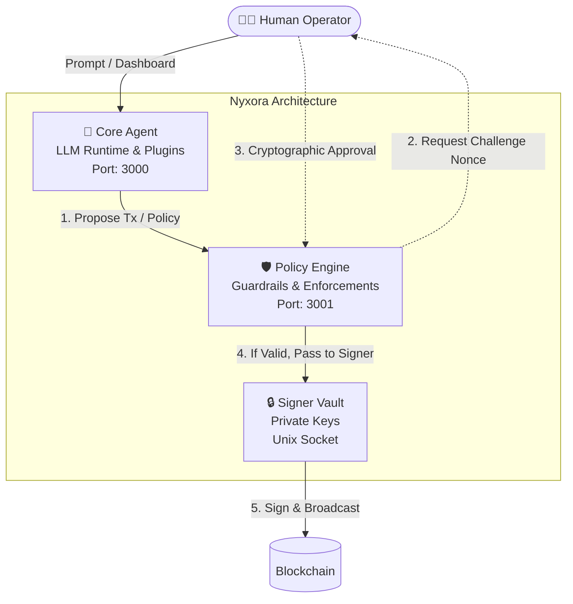

# Nyxora Agent 🤖
**Production-Grade Secure AI Execution Framework for Web3 Agents.**

[](https://github.com/perasyudha/Nyxora)
[](https://opensource.org/licenses/MIT)
[](#️-advanced-security-threat-model)
[](#️-advanced-security-threat-model)
[](#️-advanced-security-threat-model)

Nyxora (v1.5.2) is a **secure, non-custodial runtime infrastructure for autonomous onchain agents** built with a robust Monorepo architecture (Node.js & React). Designed for autonomous workflows with a premium Glassmorphism UI dashboard and strict client-side key isolation. 

It operates under an institutional-grade **Cryptographically Bound Human-in-the-Loop** execution model, ensuring that Remote AIs (LLMs) never have unilateral access to your funds.

---

## 🔥 Key Features

### Advanced Security Architecture (v1.5.2)
*   **3-Tier IPC Architecture**: Nyxora is split into isolated processes: **Core** (LLM Runtime), **Policy Engine** (Guardrails on port 3001), and **Signer Vault** (Isolated Key Manager on Unix Sockets).
*   **Cryptographically Bound Approval**: Policy changes and transactions requested by the AI are drafted as hashes (`sha256`). Approval via the UI requires a challenge nonce, preventing Man-in-the-Middle (MITM) attacks.
*   **Immutable Policy Guardrails**: Transaction limits (e.g. `max_usd_per_tx`) are strictly enforced by the Policy Engine. The LLM has zero write-access to bypass these rules.

### Core Operations & Web3 Execution
*   **System Automation & Full OS Access**: Instruct the agent to read/write local files, run terminal commands, and browse the web natively.
*   **Anti-Rugpull & Security Scanner**: Nyxora can scan smart contracts via GoPlus Labs to detect Honeypots, Hidden Taxes, and malicious proxy upgrades before you buy.
*   **Automated Limit Orders**: Set natural language rules (e.g., "Sell my PEPE if price drops below $0.001"). Nyxora runs a background cron monitor and executes the swap while you sleep (Auto-Approve Bypass configured safely).
*   **PNL & Portfolio Tracking**: The AI scans your wallets and multiplies balances by live DEX prices to give you real-time Net Worth estimations.

### AI & UI Customization
*   **Multi-LLM Support**: Seamlessly switch between Google Gemini, OpenAI, OpenRouter, or local Ollama models.
*   **Premium Glassmorphism UI**: A gorgeous, resizable split-pane interface with Pseudo-Generative UI widgets (`<BalanceWidget>`, `<MarketWidget>`, `<SwapWidget>`).
*   **Deep Personalization**: Feed the agent custom rules via `user.md` and define its core persona via `IDENTITY.md`.

---

## 📐 Architecture Workflow

The following diagram illustrates Nyxora's **3-Tier Monorepo Architecture**, showing the isolated communication channels (REST API and Unix Socket).



---

## 🛡️ Advanced Security & Threat Model

This agent is designed with a **Zero-Knowledge to LLM** architectural pattern. 

*   **Zero-Knowledge LLM**: Remote AI Agents and Large Language Models (LLMs) **never** handle your private keys. The LLM only generates structured JSON tool calls.
*   **Cryptographic Memory Isolation**: Transaction signing occurs strictly client-side within the `Signer Vault` (a separate process). It is communicated via a secure Unix Socket (`/tmp/nyxora-signer.sock`).
*   **Immutable Policy Store & HMAC**: Security rules (`policy.yaml`) are treated as immutable configurations during runtime. Changes require explicit cryptographic human approval. 
*   **Plugin Sandboxing**: Built with future plugin ecosystems in mind. Third-party plugins are explicitly denied unrestricted `fs` (FileSystem) and `shell` access to prevent supply chain attacks.

*(Note: HMAC Signing & Challenge Nonce strict validations are part of the upcoming v1.6.0 Implementation Roadmap, currently documented as our official Security Blueprint in v1.5.2)*

---

## 🚀 Quick Start & Installation

### Local Development & Execution
With the new v1.5.2 Monorepo architecture, launching Nyxora is completely automated via the internal `launcher.ts` orchestrator.

```bash
git clone https://github.com/perasyudha/Nyxora.git
cd Nyxora
npm install

# Build all monorepo packages (Core, Policy, Signer, Dashboard)
npm run build --workspaces

# Start the Nyxora Orchestrator
npm start
```
*`npm start` will automatically boot the Core, Policy Engine, Signer Vault, and Local Dashboard UI.*

---

## 📖 Official Documentation

For complete technical deep-dives into our Cryptographic Architecture, please visit our official VitePress Documentation Site!

> **🔗 [Read the Full Nyxora Documentation Here](https://perasyudha.github.io/Nyxora/)**

*(Includes guides on Secure Wallet Imports, Architecture Blueprints, Troubleshooting, and Custom Skill Development).*

---
**License:** MIT License
