# Nyxora Agent 🤖

[](https://opensource.org/licenses/MIT)
[](#)
[](#)
[](#)

A **secure, non-custodial, AI-native Web3 and System Automation Agent** built with Node.js and React. Designed for autonomous workflows with a premium Glassmorphism UI dashboard and client-side key isolation. It operates under a strict **Human-in-the-Loop** execution model for financial transactions, requiring explicit operator approval for any on-chain action.

---

## Key Features

### Advanced Trading, Security & Operations (New in v1.4.1)
*   **System Automation & Full OS Access**: Instruct the agent to read/write local files, run terminal commands, and browse the web natively.
*   **NLP Security Policy**: Command Nyxora using natural language to set security boundaries (e.g., *"Never touch partition E"*). Nyxora autonomously enforces these rules.
*   **Dynamic Plugin Manager**: Dynamically load community-built skills. Simply provide a GitHub Gist URL, and Nyxora will hot-load the third-party skill.
*   **Anti-Rugpull & Security Scanner**: Nyxora can scan smart contracts via GoPlus Labs to detect Honeypots, Hidden Taxes, and malicious proxy upgrades before you buy.
*   **Automated Limit Orders**: Set natural language rules (e.g., "Sell my PEPE if price drops below $0.001"). Nyxora runs a background cron monitor and executes the swap while you sleep.
*   **PNL & Portfolio Tracking**: The AI scans your wallets and multiplies balances by live DEX prices to give you real-time Net Worth estimations.

### Core Features
*   **Multi-LLM Support**: Seamlessly switch between Google Gemini, OpenAI, OpenRouter (unlimited models!), or local Ollama models dynamically.
*   **Premium Glassmorphism UI**: A gorgeous, resizable split-pane interface with Pseudo-Generative UI widgets (`<BalanceWidget>`, `<MarketWidget>`, `<SwapWidget>`).
*   **Round-Robin API Rotation**: Add up to 10 API keys via the dashboard. The system will auto-rotate them to prevent rate-limiting and token drain.
*   **Deep Personalization**: Feed the agent custom rules via `user.md` and define its core persona via `IDENTITY.md`.
*   **Multi-Lingual Auto-Sync**: The agent natively detects your language and replies in the exact same language automatically.
*   **Omnichannel Approvals & Telegram Integration**: Connect Nyxora to a Telegram Bot to execute trades, check prices, and chat on the go. Approve transactions directly from Telegram inline buttons!
*   **Multi-Chain Support**: Pre-configured support for Ethereum, Base, BSC, Arbitrum, Optimism, and Sepolia Testnet.

---

## 📐 Architecture Workflow

This diagram shows how user interactions flow through the Nyxora Agent, from chat input to on-chain or OS execution:



---

## 🛡️ Safety Model

To protect user assets and prevent common security concerns associated with AI agents, `Nyxora` operates under a strict safety specification:

*   **No .env Leaks**: Your Private Key is encrypted using `AES-256-GCM` and locked behind a custom Master Password in `~/.nyxora/keystore.json`.
*   **No Credential Collection**: Private keys are handled strictly within local volatile memory and are never transmitted to LLM providers.
*   **Explicit Transaction Confirmation**: Write actions (like transfers, swaps, bridges) require manual, explicit confirmation from the human operator via the Web Dashboard or Telegram before broadcasting.
*   **Human-in-the-Loop Execution**: The tool is engineered as a secure operational utility. The AI agent acts as a command generator, leaving financial execution authority with the human controller.

---

## 📋 Example Safe Workflows

The agent is designed for Web3 exploration, daily operations, and secure transaction execution. Typical workflows include:

*   **Audit New Tokens**: Tell the AI, *"Check if the contract 0x... on Base is safe to buy."*
*   **Track Portfolio Assets**: Tell the AI, *"What is my total net worth across all chains right now?"*
*   **Automate Trading**: Tell the AI, *"Create a limit order to sell 1000 USDC for ETH if ETH drops below $3000."*
*   **System Operations**: Tell the AI, *"Check my computer's RAM usage and save it to stats.txt."*

---

## 🔒 Security, Threat Model & Permission Boundary

This agent is designed with a **Zero-Knowledge to LLM** architectural pattern to ensure the highest levels of security:

*   **Zero-Knowledge to AI Agent (LLM)**: Remote AI Agents and Large Language Models (LLMs) **never** handle your private keys. The LLM only generates structured JSON tool calls.
*   **Cryptographic Memory Isolation**: Transaction signing occurs strictly client-side within the local Node.js process runtime using `viem`. 

### 🛡️ Threat Model
*   **NLP Sandboxing**: System access is bounded by plain-text rules defined in `security_policy.md`. The AI evaluates its own actions against this policy before execution.
*   **Strict API Auth**: The local Express server is protected via ephemeral Session Tokens (`x-nyxora-token`) and Strict CORS.
*   **Non-Autonomous Financials**: The tool never executes unsolicited on-chain actions. Every financial transaction is queued pending human approval.

### 📋 Permission Boundary Matrix

| Access Category | Permission Boundary | Rationale |
| :--- | :--- | :--- |
| **Read Access** | Read-Only Blockchain Queries | Fetching balances, contract security audits, transaction logs, and technical indicators. |
| **Write Access**| Optional Wallet Signing | Required **only** for broadcasting transactions (swap, bridge, mint, transfer). Locked behind Human Approval. |
| **Network Access**| Bounded Public APIs | Restricted strictly to the configured RPC endpoints, Block Explorers, DexScreener, and LLM APIs. |
| **System Access**| Local Machine Access | Governed entirely by `security_policy.md`. The agent can run OS commands but will halt if it detects a policy violation. |

For the full detailed security specifications, contact info, and vulnerability reporting procedures, refer to the [SECURITY.md](SECURITY.md) policy document.

---

## 🚀 Quick Start & Installation

Nyxora is available on NPM and can be installed as a global CLI tool on your operating system.

### 1. Global Installation
Open your terminal (Command Prompt, PowerShell, or Linux Terminal) and run:
```bash
npm install -g nyxora
```

### 2. Launching Nyxora
No need to navigate to any specific folder! Just type:
```bash
nyxora
```
On first launch, Nyxora will greet you with an **Interactive Setup Wizard**. This CLI wizard will guide you to securely configure your LLM providers, API keys, and Master Password Wallet. 

The system will automatically initialize a secure vault in your `~/.nyxora/` directory and open the Web Dashboard in your browser!

## Architecture
*   **Backend**: Node.js, Express, Viem (Web3), node-telegram-bot-api, OpenAI API.
*   **Frontend**: React, Vite, Vanilla CSS, Web Speech API (TTS/STT).
*   **Data**: Local `~/.nyxora/config.yaml` and `~/.nyxora/memory.json`.

## License
MIT License
