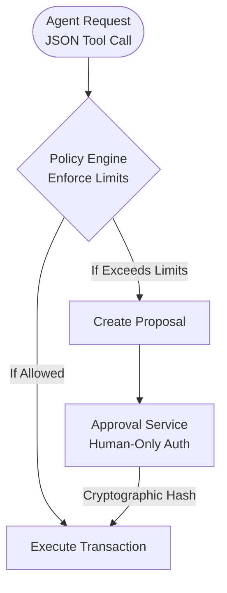

# Policy Engine & Plugin Sandbox (v1.5.2)

Security is the absolute backbone of the Nyxora ecosystem. Because Nyxora supports autonomous Web3 execution and community-built *External Skills* (Third-Party Plugins), protecting your system against **Prompt Injections** and **Supply Chain Attacks** is our highest priority.

In v1.5.2, we introduced the **Policy Engine**, a robust gatekeeper that enforces immutable security rules outside of the LLM's reach.

---

## 🛡️ The Policy Enforcement Layer

The Policy Engine sits between the Core LLM Runtime and the Signer Vault. It acts as an absolute firewall. 
Even if the LLM is somehow convinced via Prompt Injection to send all your funds to an attacker, the transaction will be intercepted by the Policy Engine.

### Propose vs. Commit Separation
To prevent AI manipulation, Nyxora separates authorization powers:
1. **`propose_policy_change()` (AI-Only):** The LLM can only *draft* proposals for policy changes or high-value transactions.
2. **`commit_policy_change()` (Human-Only Auth):** Only a human can commit the change, authenticated by a strict backend **Challenge Nonce** (`sha256(policy_diff + timestamp + user_id)`). The AI cannot unilaterally approve its own proposals.

---

## 🔒 Isolation Architecture (Plugin Sandboxing)

Whenever you download and install a third-party *Skill* into the `src/external_skills/` directory, that code is **NEVER** executed directly at the system level.

Instead, Nyxora creates an airtight *isolation chamber* (Sandbox) within memory using the native Node.js `vm` module. Third-party code is forced to live and execute exclusively within this chamber.

### 🚫 Strict Blacklisting
Inside the Sandbox, the native `require` function has been stripped down. Permanently **blocked modules** include:
- `fs` (File System): Plugins cannot read or delete your keystore.
- `child_process`: Plugins cannot open a terminal or execute silent background commands (e.g., `rm -rf`).
- `os`, `net`, `tls`, `cluster`: Blocked to prevent low-level network exploitation.

### ✅ Permitted Modules
We whitelist guaranteed-safe modules:
- `crypto`: For encryption computations.
- `math` and native `String` manipulation utilities.
- `node-fetch` / `axios`: Plugins are **permitted** to make external API calls (e.g., fetching live token prices), but they cannot save data locally.

## 🛡️ Dual-Layer Security Harmony

If a third-party Plugin needs to save its output, the plugin must hand the raw data back to the Nyxora AI. The Nyxora AI then evaluates the action against the **Policy Engine**. If it passes, the Core Runtime will securely execute the action on behalf of the plugin. 

With this design, external functions can infinitely expand Nyxora's capabilities without ever touching a single OS-level permission on your machine!
